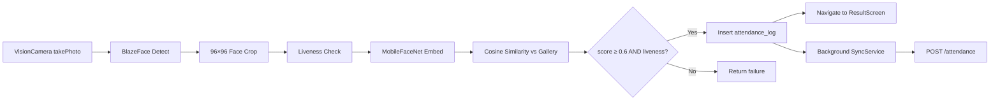

# VisionX — Offline-First Face Authentication Attendance

> **Hackathon 2026 · VisionX Team Repository**

VisionX is a mobile face-authentication attendance system designed for **offline-first** operation. The app captures attendance via on-device face recognition, stores records in an encrypted local database, and syncs to AWS when connectivity is available.

This monorepo integrates four team modules:

| Module | Directory | Owner | Responsibility |
|--------|-----------|-------|----------------|
| ML Pipeline | `ml-pipeline/` | M1 | Model training, ONNX export, enrollment schema |
| Inference Engine | `inference-engine/` | M2 | Python reference pipeline & benchmarks |
| Native Module | `native-module/` + `rn-app/.../android/` | M3 | Kotlin/Swift bridge, SQLCipher DB, AWS sync |
| React Native App | `rn-app/DatalakeFaceAuth/` | M4 | Camera UI, enrollment flow, attendance history |

**Platform status:** Android is fully integrated. iOS has reference stubs in `native-module/ios/` but is not yet wired into the RN app.

---

## Table of Contents

- [Features](#features)
- [Architecture](#architecture)
- [Repository Structure](#repository-structure)
- [Technology Stack](#technology-stack)
- [Prerequisites](#prerequisites)
- [Getting Started](#getting-started)
- [Model Setup](#model-setup)
- [Configuration](#configuration)
- [Native Module API](#native-module-api)
- [Application Workflows](#application-workflows)
- [Database Schema](#database-schema)
- [Cloud Sync API](#cloud-sync-api)
- [ML Pipeline](#ml-pipeline)
- [Inference Engine](#inference-engine)
- [React Native App](#react-native-app)
- [Security](#security)
- [Testing](#testing)
- [Known Gaps & Roadmap](#known-gaps--roadmap)
- [Related Documentation](#related-documentation)

---

## Features

- **On-device face recognition** — BlazeFace detection → MobileFaceNet 512-d embedding → cosine similarity matching (threshold ≥ 0.6)
- **Liveness detection** — FaceMesh eye-aspect-ratio (EAR) blink detection + Laplacian texture spoof rejection
- **Multi-pose enrollment** — 5-photo capture (straight, up, down, left, right) with embedding averaging
- **Encrypted local storage** — SQLCipher AES-256 with per-device key derivation
- **Background cloud sync** — WorkManager (Android) batches attendance records to AWS every 15 minutes
- **ACK-before-purge** — Successfully synced records are deleted locally to minimize data retention
- **Offline-first** — Full authentication and enrollment without network; sync happens opportunistically

---

## Architecture

### End-to-End System

```
┌─────────────────────────────────────────────────────────────────────────┐
│  ml-pipeline/ (M1)              inference-engine/ (M2)                  │
│  ─ w600k_mbf.onnx (13 MB)       ─ Python reference pipeline             │
│  ─ enroll.py → JSON             ─ BlazeFace → FaceMesh → MobileFaceNet  │
│  ─ SCHEMA.md (contracts)        ─ Benchmark CLI (latency + accuracy)    │
└──────────────┬──────────────────────────────┬─────────────────────────────┘
               │ .tflite models              │ validation reference
               ▼                             ▼
┌─────────────────────────────────────────────────────────────────────────┐
│  Android Native Layer (M3)                                              │
│  FaceAuthModule.kt  →  inference/FaceDetector.kt   (BlazeFace TFLite)  │
│                    →  inference/FaceEmbedder.kt    (MobileFaceNet 512-d)│
│                    →  inference/LivenessDetector.kt (FaceMesh EAR)      │
│                    →  DatabaseManager.kt          (SQLCipher AES-256)  │
│                    →  SyncService.kt              (WorkManager 15 min)│
└──────────────┬──────────────────────────────────────────────────────────┘
               │ NativeModules.FaceAuthModule (JNI bridge)
               ▼
┌─────────────────────────────────────────────────────────────────────────┐
│  React Native App (M4) — rn-app/DatalakeFaceAuth/                       │
│  App.tsx → FaceAuthService.ts → NativeModule.ts → Screens               │
│  CameraScreen · EnrollmentScreen · ResultScreen · HistoryScreen         │
└─────────────────────────────────────────────────────────────────────────┘
               │ POST /attendance (when online)
               ▼
┌─────────────────────────────────────────────────────────────────────────┐
│  AWS API Gateway + Lambda → DynamoDB (attendance_records)             │
└─────────────────────────────────────────────────────────────────────────┘
```

### Authentication Pipeline



### Layered Bridge Architecture

```
┌──────────────────────────────────────────┐
│  Screens (TypeScript)                    │
│  CameraScreen / EnrollmentScreen / ...   │
└────────────────┬─────────────────────────┘
                 │ FaceAuthService.ts
                 ▼
┌──────────────────────────────────────────┐
│  NativeModule.ts (M3→M4 contract)       │
│  NativeModules.FaceAuthModule            │
└────────────────┬─────────────────────────┘
                 │ JNI / Obj-C bridge
                 ▼
┌──────────────────────────────────────────┐
│  FaceAuthModule.kt (Android)             │
│  FaceAuthPackage.kt → MainApplication.kt │
└──────────────────────────────────────────┘
```

---

## Repository Structure

```
VisionX/
├── README.md                          # This file
├── docs/
│   └── INTEGRATION.md                 # Cross-team integration guide
│
├── ml-pipeline/                       # M1 — ML training & model artifacts
│   ├── models/w600k_mbf.onnx          # InsightFace MobileFaceNet (512-d)
│   ├── enrollment/enroll.py           # CLI enrollment → JSON
│   ├── enrollment/SCHEMA.md           # Embedding schema contract
│   ├── benchmarks/                    # Accuracy & latency CSVs
│   └── training/colab_production_pipeline.py
│
├── inference-engine/                  # M2 — Python reference implementation
│   └── src/
│       ├── main.py                    # Benchmark CLI
│       ├── inference_pipeline.py      # Full detect → liveness → embed pipeline
│       ├── face_detector.py
│       ├── liveness.py
│       ├── similarity.py
│       └── constants.py               # Shared thresholds (must match Kotlin)
│
├── native-module/                     # M3 — Canonical native sources & contracts
│   ├── NativeModule.ts                # TypeScript bridge types
│   ├── android/                       # Reference Kotlin implementations
│   ├── ios/                           # Reference Swift stubs (not integrated)
│   ├── database/schema.sql            # SQLCipher schema
│   └── api-contract/
│       ├── API_SPEC.md                # REST API specification
│       └── lambda_handler.py          # AWS Lambda handler
│
└── rn-app/
    ├── README.md                      # Standard RN getting-started
    └── DatalakeFaceAuth/              # M4 — Main mobile application
        ├── App.tsx                    # App entry, calls initializeFaceAuth()
        ├── src/
        │   ├── NativeModule.ts        # JS bridge (M3→M4 contract)
        │   ├── services/FaceAuthService.ts
        │   ├── navigation/AppNavigator.tsx
        │   ├── screens/               # Camera, Enrollment, Result, History
        │   └── components/SyncBadge.tsx
        ├── android/                   # Integrated Kotlin native code
        │   └── app/src/main/java/com/datalakefaceauth/
        │       ├── FaceAuthModule.kt
        │       ├── DatabaseManager.kt
        │       ├── SyncService.kt
        │       └── inference/
        │           ├── FaceDetector.kt
        │           ├── FaceEmbedder.kt
        │           └── LivenessDetector.kt
        └── ios/                       # Standard RN scaffold (no FaceAuth yet)
```

---

## Technology Stack

### Mobile App (React Native)

| Component | Version |
|-----------|---------|
| React | 19.2.3 |
| React Native | 0.85.3 |
| TypeScript | ^5.8.3 |
| Node.js | ≥ 22.11.0 |
| react-native-vision-camera | ^3.9.2 |
| @react-navigation/native | ^7.2.5 |
| react-native-reanimated | ^4.4.0 |
| Hermes | Enabled |
| New Architecture | Enabled |

### Android Native

| Component | Version |
|-----------|---------|
| compileSdk / targetSdk | 36 |
| minSdk | 24 |
| Kotlin | 2.1.20 |
| NDK | 27.1.12297006 |
| Gradle | 8.13 |
| SQLCipher | 4.5.4 |
| TensorFlow Lite | 2.14.0 (+ GPU delegate) |
| WorkManager | 2.9.0 |

### ML Model

| Property | Value |
|----------|-------|
| Architecture | InsightFace MobileFaceNet (`w600k_mbf`) |
| Training data | WebFace600K (600K identities) |
| Input | 96×96 RGB (TFLite) / 112×112 (ONNX) |
| Output | 512-d L2-normalized embedding |
| Format (repo) | ONNX (13 MB) |
| Match threshold | Cosine similarity ≥ **0.6** |
| Benchmark accuracy | 99.30% (standard lighting) |

---

## Prerequisites

### All Platforms

- Node.js ≥ 22.11.0
- npm or yarn

### Android Development

- Android Studio Hedgehog or later
- Android SDK 36, NDK r26+
- JDK 17+
- Physical device or emulator with **arm64-v8a** or **x86_64** ABI
- `adb` for model deployment

### iOS Development (scaffold only)

- macOS with Xcode
- CocoaPods (`bundle install` + `bundle exec pod install`)

### Python Benchmark (optional)

- Python 3.9+
- numpy, opencv-python, tensorflow (or tflite-runtime)

---

## Getting Started

### 1. Clone and Install Dependencies

```bash
cd rn-app/DatalakeFaceAuth
npm install
```

### 2. Deploy ML Models to Device

TFLite models are **not bundled in the repository**. Push them to the device before first run:

```bash
adb shell mkdir -p /data/data/com.datalakefaceauth/files/models
adb push blazeface.tflite         /data/data/com.datalakefaceauth/files/models/
adb push mobilefacenet.tflite     /data/data/com.datalakefaceauth/files/models/
adb push face_mesh_lite.tflite    /data/data/com.datalakefaceauth/files/models/
```

> **Production note:** Bundle models in `android/app/src/main/assets/models/` and copy to `filesDir` on first launch using `AssetManager`.

### 3. Start Metro Bundler

```bash
npm start
```

### 4. Run on Android

```bash
npm run android
```

### 5. Run on iOS (macOS only)

```bash
cd ios
bundle install
bundle exec pod install
cd ..
npm run ios
```

> iOS will launch the RN scaffold but **face authentication is not functional** until the Swift native module is integrated.

---

## Model Setup

### Required On-Device Models

| File | Purpose | Input Size |
|------|---------|------------|
| `blazeface.tflite` | Face detection & 96×96 crop | 128×128 RGB |
| `mobilefacenet.tflite` | 512-d face embedding | 96×96 RGB |
| `face_mesh_lite.tflite` | Liveness (EAR blink detection) | 192×192 RGB |

### Model Directory

The app expects models at:

```
/data/data/com.datalakefaceauth/files/models/
```

This path is configured in `FaceAuthService.ts` and passed to `FaceAuthModule.initialize()` on app startup.

### ONNX Source Model

The training artifact `ml-pipeline/models/w600k_mbf.onnx` must be converted to `mobilefacenet.tflite` for on-device inference. See `ml-pipeline/README.md` for conversion guidance.

---

## Configuration

### Android BuildConfig

Set in `rn-app/DatalakeFaceAuth/android/app/build.gradle`:

| Field | Default | Description |
|-------|---------|-------------|
| `DB_SECRET` | `visionx_db_secret_hackathon_2026` | Combined with device ID for SQLCipher key |
| `AWS_SYNC_ENDPOINT` | `https://api.visionx.example.com/v1/attendance` | Cloud sync URL |
| `AWS_API_KEY` | `vx_dev_placeholder_key` | Per-device API key |

**Change all defaults before production release.**

### Gradle Properties

Key settings in `android/gradle.properties`:

```properties
hermesEnabled=true
newArchEnabled=true
VisionCamera_disableFrameProcessors=true
```

### Database Encryption Key Derivation

| Platform | Device ID | Secret | Formula |
|----------|-----------|--------|---------|
| Android | `Settings.Secure.ANDROID_ID` | `BuildConfig.DB_SECRET` | `SHA-256(deviceId + ":" + secret)` |
| iOS (planned) | `UIDevice.identifierForVendor` | `Info.plist → DB_SECRET` | `SHA-256(deviceId + secret)` |

### Android Permissions

Declared in `AndroidManifest.xml`:

- `INTERNET` — cloud sync
- `CAMERA` — face capture
- `ACCESS_FINE_LOCATION` / `ACCESS_COARSE_LOCATION` — geotagged attendance (not yet wired at runtime)

---

## Native Module API

The TypeScript contract in `src/NativeModule.ts` is the canonical M3→M4 interface. **Do not change method signatures without team coordination.**

### Methods

| Method | Parameters | Returns | Description |
|--------|------------|---------|-------------|
| `initialize` | `modelPath: string` | `Promise<void>` | Load TFLite models and open SQLCipher DB |
| `enrollFace` | `name: string`, `imagePaths: string[]` | `Promise<EnrollResult>` | Detect, embed, average, and store face |
| `authenticate` | `frameBase64: string` | `Promise<AuthResult>` | Full pipeline on base64 JPEG/PNG |
| `authenticateFromPath` | `filePath: string` | `Promise<AuthResult>` | **Preferred** — uses VisionCamera photo path |
| `startLivenessChallenge` | — | `Promise<void>` | Start blink → turn challenge |
| `getLivenessChallengeState` | — | `Promise<LivenessState>` | Poll challenge progress |

### Type Definitions

```typescript
interface EnrollResult {
  success: boolean;
  id: string;          // UUID matching enrolled_faces.id
}

interface AuthResult {
  matched: boolean;    // true if score ≥ 0.6 AND livenessPass
  name: string;
  score: number;       // cosine similarity 0–1
  livenessPass: boolean;
}

interface LivenessState {
  step: 'blink' | 'turn' | 'done' | 'failed';
  progress: number;    // 0–1 within current step
}
```

### Kotlin Inference Classes

```kotlin
// com.datalakefaceauth.inference

class FaceDetector(modelDir: String) {
    fun detectFace(bitmap: Bitmap): Bitmap?   // 96×96 crop or null
}

class FaceEmbedder(modelDir: String) {
    fun extractEmbedding(faceBitmap: Bitmap): FloatArray  // 512-d L2-normalized
}

class LivenessDetector(modelDir: String) {
    fun checkLiveness(faceBitmap: Bitmap): Boolean
}
```

### Registration

The native module is registered in `MainApplication.kt`:

```kotlin
PackageList(this).packages.apply {
    add(FaceAuthPackage())  // exposes NativeModules.FaceAuthModule
}
SyncService.schedulePeriodic(this)  // background sync on app start
```

---

## Application Workflows

### Face Authentication

1. `App.tsx` calls `initializeFaceAuth()` on mount
2. `CameraScreen` requests camera permission and opens the front camera
3. Every ~1.2 seconds, `camera.takePhoto()` captures a frame
4. `FaceAuthService.authenticatePhoto(path)` → `FaceAuthModule.authenticateFromPath(path)`
5. Native pipeline runs: **detect → liveness → embed → match**
6. On match (`score ≥ 0.6` and `livenessPass`): record inserted into `attendance_log`
7. UI navigates to `ResultScreen` (auto-dismisses after 3 seconds)

### Face Enrollment

1. `EnrollmentScreen` prompts user for a display name
2. Captures 5 photos with pose instructions: straight, up, down, left, right
3. `FaceAuthService.enrollFace(name, paths)` → native module
4. Per image: detect face → extract 512-d embedding
5. Embeddings are averaged and stored in `enrolled_faces`
6. Navigate to `EnrollmentConfirmationScreen` with UUID

> **Note:** The Enrollment screen is registered in navigation but currently has no entry point from the Camera screen.

### Background Sync

```
Auth success → attendance_log (synced=0)
     ↓ (every 15 min, network available)
SyncService builds JSON batch
     ↓
POST /attendance with x-api-key header
     ↓ (HTTP 200 + acknowledged_ids)
markAsSynced → deleteRecord (ACK-before-purge)
```

Sync runs entirely on the native side via WorkManager. No JavaScript involvement.

### Mock Fallback

When `NativeModules.FaceAuthModule` is unavailable (Jest, Expo Go), `FaceAuthService.ts` falls back to mock authentication and history data so the UI remains functional.

---

## Database Schema

Encrypted SQLite database managed by `DatabaseManager.kt`. Schema defined in `native-module/database/schema.sql`.

### SQLCipher Configuration

```sql
PRAGMA cipher_compatibility = 4;
PRAGMA kdf_iter = 256000;
PRAGMA cipher_page_size = 4096;
PRAGMA journal_mode = WAL;
PRAGMA foreign_keys = ON;
```

### Tables

#### `enrolled_faces`

| Column | Type | Description |
|--------|------|-------------|
| `id` | TEXT PK | UUID v4 |
| `name` | TEXT | Display name |
| `embedding` | BLOB | 512 × float32 = **2048 bytes** |
| `enrolled_at` | INTEGER | Unix epoch (seconds) |
| `synced` | INTEGER | 0 = pending, 1 = synced |

#### `attendance_log`

| Column | Type | Description |
|--------|------|-------------|
| `id` | TEXT PK | UUID v4 |
| `face_id` | TEXT FK | References `enrolled_faces.id` |
| `timestamp` | INTEGER | Unix epoch (seconds) |
| `lat` | REAL | Latitude (-90 to 90) |
| `lng` | REAL | Longitude (-180 to 180) |
| `liveness_score` | REAL | 0.0 to 1.0 |
| `auth_score` | REAL | 0.0 to 1.0 |
| `synced` | INTEGER | 0 = pending, 1 = synced |
| `aws_ack` | INTEGER | 0 = not acknowledged, 1 = acknowledged |

### Indexes

- `idx_enrolled_faces_synced`
- `idx_attendance_log_synced`
- `idx_attendance_log_face_id`
- `idx_attendance_log_timestamp`

---

## Cloud Sync API

Full specification: [`native-module/api-contract/API_SPEC.md`](native-module/api-contract/API_SPEC.md)

### Endpoint

```
POST https://api.visionx.example.com/v1/attendance
```

### Authentication

```
x-api-key: <device-scoped-api-key>
Content-Type: application/json
```

### Request Body

```json
{
  "records": [
    {
      "id": "550e8400-e29b-41d4-a716-446655440000",
      "face_id": "7c9e6679-7425-40de-944b-e07fc1f90ae7",
      "timestamp": 1717500000,
      "lat": 28.6139,
      "lng": 77.2090,
      "liveness_score": 0.97,
      "auth_score": 0.91
    }
  ]
}
```

### Response (200 OK)

```json
{
  "statusCode": 200,
  "message": "Batch processed successfully",
  "acknowledged_ids": ["550e8400-e29b-41d4-a716-446655440000"],
  "failed_ids": []
}
```

### Limits

| Constraint | Value |
|------------|-------|
| Max records per batch | 100 |
| Requests per minute | 100 |
| Sync interval | 15 minutes |

### Backend

`native-module/api-contract/lambda_handler.py` validates records and writes to DynamoDB table `attendance_records`.

---

## ML Pipeline

Directory: `ml-pipeline/`

### Model: InsightFace MobileFaceNet (`w600k_mbf`)

```
Camera → BlazeFace (detect) → MobileFaceNet (embed) → Cosine Match → Auth
              ~1.5 MB               13 MB ONNX              threshold ≥ 0.6
```

| Metric | Value |
|--------|-------|
| Architecture | MobileFaceNet (depthwise separable convolutions) |
| Training data | WebFace600K (600K identities, 10M+ images) |
| Loss function | ArcFace (additive angular margin) |
| Input (ONNX) | `(1, 3, 112, 112)` NCHW, RGB, `(x-127.5)/127.5` |
| Output | 512-d L2-normalized embedding |
| Benchmark accuracy | 99.30% standard · 98.69% harsh sun · 99.10% low light |
| Inference latency | ~14 ms average |

### Enrollment CLI

```bash
cd ml-pipeline
python enrollment/enroll.py --name "John Doe" --images ./photos/
```

Produces JSON conforming to `enrollment/SCHEMA.md`:

```json
{
  "name": "John Doe",
  "embedding": [-0.0345, 0.1239, ...],
  "enrolled_at": "2026-06-03T18:00:00.000000Z"
}
```

### Reproducing the Model

1. Open [Google Colab](https://colab.research.google.com)
2. Run `training/colab_production_pipeline.py`
3. Download `w600k_mbf.onnx` from the Colab file browser

---

## Inference Engine

Directory: `inference-engine/`

Python reference implementation that mirrors the Android Kotlin pipeline. Used for benchmarking and validation.

### Run Benchmark

```bash
cd inference-engine
pip install numpy opencv-python tensorflow

python src/main.py \
  --model-dir ./models \
  --test-dir  ./test_images \
  --threshold 0.6
```

Output: `benchmarks/latency_log.csv` and `benchmarks/accuracy_report.csv`

### Shared Constants

Values in `inference-engine/src/constants.py` must match the Kotlin implementation:

| Constant | Value | Kotlin equivalent |
|----------|-------|-------------------|
| `EMBEDDING_DIM` | 512 | `FaceEmbedder.kt` |
| `FACE_INPUT_SIZE` | 96 | `FaceEmbedder.kt` |
| `SIMILARITY_THRESHOLD` | 0.6 | `FaceAuthModule.COSINE_SIMILARITY_THRESHOLD` |
| `EAR_OPEN_THRESHOLD` | 0.20 | `LivenessDetector.kt` |

---

## React Native App

Directory: `rn-app/DatalakeFaceAuth/`

### Screens

| Screen | File | Purpose |
|--------|------|---------|
| Camera | `src/screens/CameraScreen.tsx` | Live authentication via front camera |
| Enrollment | `src/screens/EnrollmentScreen.tsx` | 5-pose face enrollment |
| Enrollment Confirmation | `src/screens/EnrollmentConfirmationScreen.tsx` | Success summary |
| Result | `src/screens/ResultScreen.tsx` | Auth result modal (3s auto-dismiss) |
| History | `src/screens/HistoryScreen.tsx` | Attendance log viewer |

### Navigation

`src/navigation/AppNavigator.tsx` — stack navigator with Camera as home. History accessible via header button.

### Service Layer

`src/services/FaceAuthService.ts` wraps the native module with:

- `initializeFaceAuth()` — called from `App.tsx`
- `authenticatePhoto(path)` — preferred auth path
- `enrollFace(name, paths)` — enrollment
- `getAttendanceLog()` — currently returns mock data (see roadmap)

### Components

- `src/components/SyncBadge.tsx` — network status and pending sync count in header

### Scripts

```bash
npm start          # Metro bundler
npm run android    # Build and run on Android
npm run ios        # Build and run on iOS
npm test           # Jest tests
npm run lint       # ESLint
```

---

## Security

| Concern | Implementation |
|---------|----------------|
| Data at rest | SQLCipher AES-256 with PBKDF2 (256K iterations) |
| Key management | Per-device key derived from hardware ID + build secret |
| API authentication | Device-scoped `x-api-key` on all sync requests |
| Embedding storage | 2048-byte BLOBs (not human-readable) |
| Data minimization | ACK-before-purge deletes synced attendance locally |
| Model integrity | TFLite models loaded from app-private `filesDir` |

### Pre-Release Checklist

- [ ] Replace `DB_SECRET` with a production secret
- [ ] Provision real `AWS_API_KEY` per device
- [ ] Update `AWS_SYNC_ENDPOINT` to production API Gateway URL
- [ ] Bundle and sign release APK with production keystore
- [ ] Enable ProGuard for release builds

---

## Testing

### React Native (Jest)

```bash
cd rn-app/DatalakeFaceAuth
npm test
```

Tests run with mock native module fallback when `FaceAuthModule` is unavailable.

### Python Inference

```bash
cd inference-engine
python -m pytest test/
```

### Manual Integration Test (Android)

1. Push TFLite models to device (see [Model Setup](#model-setup))
2. Enroll a test face via `EnrollmentScreen`
3. Authenticate via `CameraScreen`
4. Verify attendance record via `adb logcat` (tag: `FaceAuthModule`)
5. Confirm sync attempt in `SyncService` logs when network is available

---

## Known Gaps & Roadmap

| # | Item | Owner | Priority |
|---|------|-------|----------|
| 1 | Convert `w600k_mbf.onnx` → `mobilefacenet.tflite` | M1 | Critical |
| 2 | Bundle TFLite models in Android assets + copy-on-first-launch | M3 | Critical |
| 3 | Expose `getAllAttendanceRecords()` via NativeModule for real history | M3 | High |
| 4 | Replace AWS endpoint placeholder with real API Gateway URL | M3 | High |
| 5 | Accuracy-vs-threshold benchmark table | M2 | High |
| 6 | iOS Swift module parity and RN integration | M3 | Medium |
| 7 | GPS runtime permission request in CameraScreen | M4 | Medium |
| 8 | Navigation entry point to Enrollment screen | M4 | Medium |
| 9 | Add `react-native-vector-icons` to `package.json` | M4 | Low |
| 10 | Populate `inference-engine/requirements.txt` | M2 | Low |

### Platform Parity Notes

| Feature | Android | iOS |
|---------|---------|-----|
| FaceAuthModule | Integrated | Stub only (`native-module/ios/`) |
| `authenticateFromPath` | Yes | Not exposed |
| Embedding dimension | 512-d (2048 bytes) | 128-d in stub (mismatch) |
| SQLCipher | Integrated | Reference only |
| Background sync | WorkManager | BGTaskScheduler (reference) |

---

## Related Documentation

| Document | Path | Description |
|----------|------|-------------|
| Integration Guide | [`docs/INTEGRATION.md`](docs/INTEGRATION.md) | Cross-team contracts and build setup |
| Native Module | [`native-module/README.md`](native-module/README.md) | Bridge API, DB, sync details |
| ML Pipeline | [`ml-pipeline/README.md`](ml-pipeline/README.md) | Model specs and benchmarks |
| Enrollment Schema | [`ml-pipeline/enrollment/SCHEMA.md`](ml-pipeline/enrollment/SCHEMA.md) | JSON + SQLite contract |
| API Specification | [`native-module/api-contract/API_SPEC.md`](native-module/api-contract/API_SPEC.md) | REST API full spec |
| Database Schema | [`native-module/database/schema.sql`](native-module/database/schema.sql) | SQLCipher DDL |
| RN App README | [`rn-app/README.md`](rn-app/README.md) | Standard React Native setup |

---

## Team Module Ownership

```
M1 (ml-pipeline)     → Model training, ONNX export, enrollment schema
M2 (inference-engine)→ Python reference, benchmarks, threshold validation
M3 (native-module)   → Kotlin/Swift bridge, SQLCipher, AWS sync, Lambda
M4 (rn-app)          → React Native UI, camera integration, navigation
```

---

## License

Hackathon 2026 project — internal team repository.
