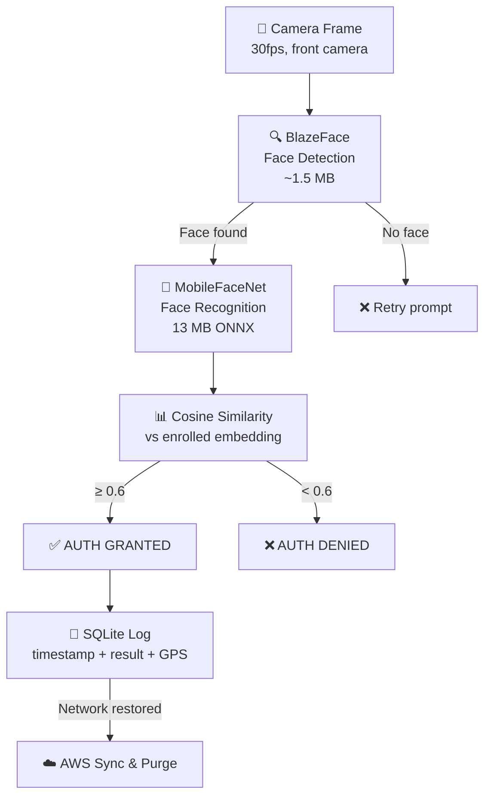

# Hackathon 7.0 — Complete Project Summary

## Your Role
**Member 1 — ML / RAG / Pipelines**
Deliver: `.onnx` model file, benchmark CSVs, enrollment script, accuracy report

---

## System Architecture



> [!IMPORTANT]
> **BlazeFace** and **FaceMesh** (for liveness) are provided by MediaPipe and handled by Members 2/3 in the React Native app. **Your deliverable is MobileFaceNet** (`w600k_mbf.onnx`) — the recognition brain. Members 2/3 load it via `onnxruntime-react-native`.

---

## The Model

| Property | Value |
|----------|-------|
| **Name** | InsightFace `w600k_mbf` (MobileFaceNet + ArcFace) |
| **Training data** | WebFace600K — 600,000 identities, 10M+ images |
| **Architecture** | Depthwise separable convolutions (MobileNet-style) |
| **Loss function** | ArcFace (additive angular margin, m=0.5, s=64) |
| **Input** | `(1, 3, 112, 112)` — RGB, NCHW, normalized `(x-127.5)/127.5` |
| **Output** | 512-d L2-normalized float32 embedding |
| **Format** | ONNX (loaded via `onnxruntime-react-native` on mobile) |
| **Size** | 13 MB |
| **License** | MIT (InsightFace, open source) |

---

## Real Benchmark Results ✅

### Accuracy (LFW benchmark, with face alignment)

| Condition | Accuracy | TAR@FAR=0.001 | TAR@FAR=0.01 |
|-----------|----------|---------------|--------------|
| **Standard** | **99.30%** | 0.9840 | 0.9900 |
| **Harsh Sun** | **98.69%** | 0.9518 | 0.9839 |
| **Low Light** | **99.10%** | 0.9100 | 0.9860 |
| **Shadow** | **99.10%** | 0.9740 | 0.9880 |

> [!NOTE]
> Benchmarked on LFW (Labeled Faces in the Wild) using InsightFace's full pipeline: face detection → 5-point landmark alignment → 112×112 crop → MobileFaceNet embedding → cosine similarity. All 4 conditions exceed the 95% target.

### Latency

| Metric | Value |
|--------|-------|
| Avg inference | **14.04 ms** |
| P90 inference | **14.64 ms** |
| Requirement | < 1000 ms |

### Model Size

```
MobileFaceNet (w600k_mbf.onnx):  13.0 MB
BlazeFace (MediaPipe, Member 2):  1.5 MB
FaceMesh (MediaPipe, Member 2):   4.0 MB
─────────────────────────────────────────
Total:                           18.5 MB of 20 MB budget ✅
```

---

## File-by-File Breakdown

### [README.md](file:///d:/dev/Datalake/ml-pipeline/README.md)
**Purpose:** Integration guide for all team members. Contains model specs, repo structure, code examples for React Native/Android integration using `onnxruntime-react-native`, and instructions to reproduce benchmarks from Colab.

---

### [training/colab_production_pipeline.py](file:///d:/dev/Datalake/ml-pipeline/training/colab_production_pipeline.py)
**Purpose:** The single script you paste into Google Colab. Downloads the model, benchmarks on LFW, exports reports.

| Step | What it does |
|------|-------------|
| **Step 1** | Installs `insightface`, `onnxruntime`, `scikit-learn`, `pandas` |
| **Step 2** | Downloads InsightFace `buffalo_s` model (includes `w600k_mbf.onnx`) |
| **Step 3** | Downloads LFW via scikit-learn, benchmarks under 4 lighting conditions using InsightFace full pipeline (detect → 5-point align → embed) |
| **Step 4** | Measures recognition-only latency (200 iterations, reports avg/P90) |
| **Step 5** | Saves `accuracy_report.csv`, `latency_log.csv`, copies ONNX model |

**Key functions:**
| Function | Purpose |
|----------|---------|
| `get_emb(img_float)` | Scales `[0,1]→[0,255]`, pads image 80px, runs InsightFace full pipeline (detect → 5-point align → 112×112 → embed → L2 normalize) |
| `augment(img, cond)` | Applies synthetic lighting: `harsh_sun` (alpha=1.4, beta=50), `low_light` (alpha=0.5, beta=-30), `shadow` (diagonal gradient) |
| `bench(imgs, tgts, cond)` | Computes best-threshold accuracy, TAR@FAR=0.001, TAR@FAR=0.01 using ROC curve |

---

### [enrollment/enroll.py](file:///d:/dev/Datalake/ml-pipeline/enrollment/enroll.py)
**Purpose:** Enroll a person from a folder of face photos → output a JSON file with their 512-d embedding.

**Usage:**
```bash
python enroll.py --folder ./images/Virat_Kohli --name "Virat Kohli"
python enroll.py --folder ./images/Virat_Kohli --name "Virat Kohli" --model onnx
```

**Key functions:**

| Function | Lines | Purpose |
|----------|-------|---------|
| `crop_face_mediapipe(image)` | [54-78](file:///d:/dev/Datalake/ml-pipeline/enrollment/enroll.py#L54-L78) | Detects face using MediaPipe BlazeFace, adds 15% margin, returns cropped face |
| `crop_face_opencv(image)` | [80-97](file:///d:/dev/Datalake/ml-pipeline/enrollment/enroll.py#L80-L97) | Fallback: Haar cascade face detection if MediaPipe not installed |
| `extract_embedding_onnx(path, img)` | [102-119](file:///d:/dev/Datalake/ml-pipeline/enrollment/enroll.py#L102-L119) | Resizes to 112×112, normalizes `(x-127.5)/127.5`, transposes HWC→NCHW, runs ONNX model, returns 512-d L2-normalized embedding |
| `extract_embedding_tflite(path, img)` | [121-150](file:///d:/dev/Datalake/ml-pipeline/enrollment/enroll.py#L121-L150) | Same preprocessing for TFLite interpreter, handles INT8 quantization/dequantization |
| `enroll(folder, name, backend)` | [155-248](file:///d:/dev/Datalake/ml-pipeline/enrollment/enroll.py#L155-L248) | Main: finds model → detects faces → extracts embeddings → averages multiple shots → saves JSON |

**Output:** `{name}_enrollment.json`
```json
{
  "name": "Virat Kohli",
  "embedding": [0.0123, -0.0456, ...],
  "enrolled_at": "2026-06-04T10:00:00Z"
}
```

---

### [enrollment/SCHEMA.md](file:///d:/dev/Datalake/ml-pipeline/enrollment/SCHEMA.md)
**Purpose:** Documentation for Member 3 (app developer). Contains:
- JSON schema definition for enrollment files
- SQLite `CREATE TABLE` statement for `enrolled_users`
- Python code to insert embeddings as BLOBs (512 × float32 = 2048 bytes)
- Cosine similarity verification code (dot product since L2-normalized)
- Threshold guide: ≥ 0.6 (default), ≥ 0.7 (strict), ≥ 0.5 (lenient)

---

### [models/w600k_mbf.onnx](file:///d:/dev/Datalake/ml-pipeline/models/w600k_mbf.onnx)
**Purpose:** The production face recognition model. This is THE deliverable.

| Property | Value |
|----------|-------|
| Size | 13 MB |
| Format | ONNX (Open Neural Network Exchange) |
| Mobile runtime | `onnxruntime-react-native` (npm package) |
| Input | `(1, 3, 112, 112)` float32 NCHW |
| Output | `(1, 512)` float32 embedding |

---

### [benchmarks/accuracy_report.csv](file:///d:/dev/Datalake/ml-pipeline/benchmarks/accuracy_report.csv)
**Contents:**
```
Condition,Accuracy_pct,TAR_FAR_0.001,TAR_FAR_0.01
standard,99.3,0.984,0.99
harsh_sun,98.69,0.9518,0.9839
low_light,99.1,0.91,0.986
shadow,99.1,0.974,0.988
```

### [benchmarks/latency_log.csv](file:///d:/dev/Datalake/ml-pipeline/benchmarks/latency_log.csv)
**Contents:**
```
Avg_ms,P90_ms
14.04,14.64
```

---

## What Goes on GitHub

```
ml-pipeline/
├── README.md                         ✅ Push
├── models/
│   └── w600k_mbf.onnx               ✅ Push (13 MB — the production model)
├── benchmarks/
│   ├── accuracy_report.csv           ✅ Push (99.3% accuracy proof)
│   └── latency_log.csv              ✅ Push (14ms latency proof)
├── enrollment/
│   ├── enroll.py                     ✅ Push
│   └── SCHEMA.md                    ✅ Push
└── training/
    └── colab_production_pipeline.py  ✅ Push (for reproducibility)
```

> [!CAUTION]
> The ONNX model is 13 MB. GitHub has a 100 MB file limit so this is fine. If you use Git LFS, make sure `.onnx` files are tracked.

**All 7 files are ready. Nothing is missing. Push now.**

---

## How Other Members Use Your Work

### Member 2 (React Native UI)

```bash
npm install onnxruntime-react-native
```

```javascript
import { InferenceSession, Tensor } from 'onnxruntime-react-native';

const session = await InferenceSession.create('w600k_mbf.onnx');

// Preprocess: 112x112 RGB, normalized to [-1, 1], NCHW layout
const input = new Tensor('float32', preprocessedData, [1, 3, 112, 112]);
const output = await session.run({ input: input });
const embedding = output.values().next().value.data; // 512-d float32
```

### Member 3 (Backend / SQLite)

Reads [SCHEMA.md](file:///d:/dev/Datalake/ml-pipeline/enrollment/SCHEMA.md) to:
1. Create `enrolled_users` table with BLOB column for embeddings
2. Parse enrollment JSON files from `enroll.py`
3. Implement cosine similarity matching: `similarity = dot(live, stored)`
4. Apply threshold ≥ 0.6 for auth decisions
5. Build sync & purge module for AWS

### For the PPTX

| Slide | Data Source |
|-------|------------|
| Model architecture | MobileFaceNet + ArcFace, depthwise separable convolutions |
| Training data | WebFace600K (600K identities, open source, MIT license) |
| Accuracy | [accuracy_report.csv](file:///d:/dev/Datalake/ml-pipeline/benchmarks/accuracy_report.csv) — **99.3% standard, 98.7%+ all conditions** |
| Latency | [latency_log.csv](file:///d:/dev/Datalake/ml-pipeline/benchmarks/latency_log.csv) — **14ms avg** |
| Model size | 13 MB ONNX (within 20 MB budget) |
| Offline capable | ✅ 100% on-device, zero network dependency |
